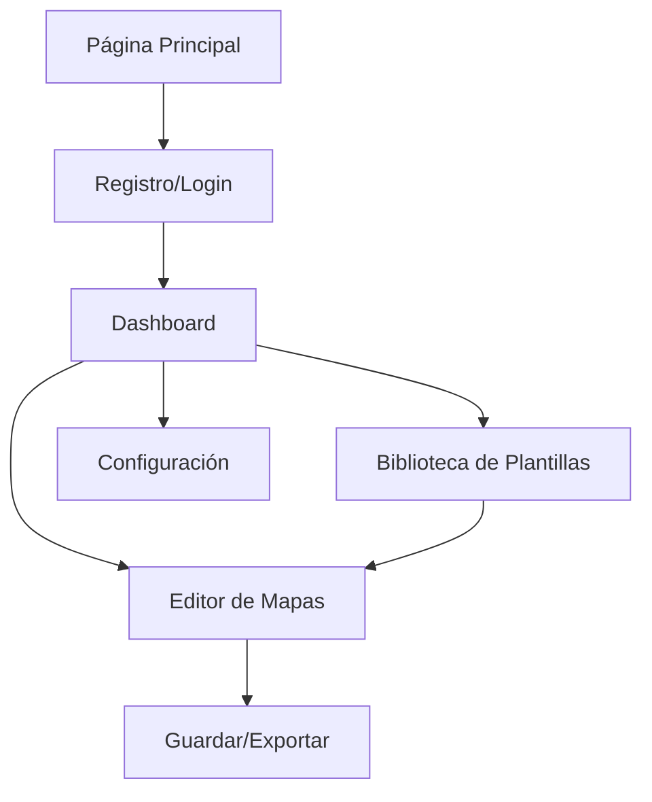

# Documentación de Requerimientos del Producto - Mapas Mentales

## 1. Descripción General del Producto

Aplicación web educativa para la creación y gestión de mapas mentales y cuadros sinópticos, diseñada para estudiantes y profesionales que necesitan organizar información de manera visual y estructurada.

La aplicación ayuda a los usuarios a crear, editar y organizar herramientas de estudio visual con un diseño minimalista inspirado en macOS, alejándose de las plantillas típicas de IA para ofrecer una experiencia única y creativa.

## 2. Características Principales

### 2.1 Funcionalidades Principales

La aplicación es completamente local y no requiere registro de usuarios. Todas las funcionalidades están disponibles desde el primer uso:
- Creación ilimitada de mapas mentales
- Acceso a todas las plantillas disponibles
- Guardado automático en el navegador
- Exportación en múltiples formatos

### 2.2 Módulo de Características

Nuestra aplicación de mapas mentales consta de las siguientes páginas principales:

1. **Página Principal**: hero section con introducción, galería de ejemplos, navegación principal
2. **Dashboard**: lista de proyectos, accesos rápidos, estadísticas de uso
3. **Editor de Mapas**: canvas interactivo, herramientas de edición, panel de propiedades
4. **Biblioteca de Plantillas**: categorías de plantillas, vista previa, filtros de búsqueda
5. **Configuración**: preferencias de usuario, gestión de cuenta, configuración de exportación

### 2.3 Detalles de Páginas

| Nombre de Página | Nombre del Módulo | Descripción de Características |
|------------------|-------------------|-------------------------------|
| Página Principal | Hero Section | Presentar la aplicación con animaciones suaves, mostrar ejemplos de mapas mentales |
| Página Principal | Galería de Ejemplos | Mostrar casos de uso reales, permitir vista previa interactiva |
| Dashboard | Lista de Proyectos | Mostrar mapas creados en formato de tarjetas, opciones de filtrado y búsqueda |
| Dashboard | Accesos Rápidos | Botones para crear nuevo mapa, acceder a plantillas, ver tutoriales |
| Editor de Mapas | Canvas Interactivo | Área de trabajo principal con zoom, pan, selección múltiple de elementos |
| Editor de Mapas | Herramientas de Edición | Agregar nodos, conectores, texto, formas, colores, estilos |
| Editor de Mapas | Panel de Propiedades | Modificar propiedades de elementos seleccionados, capas, historial |
| Biblioteca de Plantillas | Categorías | Organizar plantillas por tipo: académico, empresarial, personal |
| Biblioteca de Plantillas | Vista Previa | Mostrar plantillas con zoom, permitir personalización antes de usar |
| Configuración | Preferencias | Configurar tema, idioma, atajos de teclado, auto-guardado |

## 3. Proceso Principal

**Flujo de Usuario Básico:**
1. El usuario accede a la página principal y explora ejemplos
2. Se registra o inicia sesión
3. Accede al dashboard y ve sus proyectos existentes
4. Crea un nuevo mapa mental desde cero o selecciona una plantilla
5. Utiliza el editor para crear y personalizar su mapa
6. Guarda y exporta el resultado final

**Funcionalidades de Exportación:**
1. Exportación como imagen PNG de alta calidad
2. Exportación como archivo SVG vectorial
3. Exportación como PDF para impresión
4. Guardado automático local en el navegador

## 4. Diseño de Interfaz de Usuario

### 4.1 Estilo de Diseño

- **Colores Primarios**: #007AFF (azul sistema iOS), #34C759 (verde sistema)
- **Colores Secundarios**: #FF9500 (naranja), #FF3B30 (rojo), #5856D6 (púrpura)
- **Colores Neutros**: #F2F2F7 (fondo claro), #1C1C1E (texto oscuro), #8E8E93 (texto secundario)
- **Estilo de Botones**: Bordes redondeados (8px), efecto glassmorphism sutil
- **Tipografía**: SF Pro Display para títulos, SF Pro Text para cuerpo (fallback: system-ui)
- **Tamaños de Fuente**: 28px (títulos), 17px (cuerpo), 13px (subtítulos)
- **Estilo de Layout**: Diseño basado en tarjetas con sombras suaves, navegación superior fija
- **Iconos**: SF Symbols style, minimalistas y consistentes

### 4.2 Resumen de Diseño de Páginas

| Nombre de Página | Nombre del Módulo | Elementos de UI |
|------------------|-------------------|----------------|
| Página Principal | Hero Section | Gradiente sutil de fondo, tipografía grande, animaciones de entrada suaves |
| Página Principal | Galería | Grid responsivo, hover effects, modal de vista previa |
| Dashboard | Lista de Proyectos | Cards con sombra, estados de hover, indicadores de progreso |
| Editor de Mapas | Toolbar | Botones flotantes, tooltips, agrupación lógica de herramientas |
| Editor de Mapas | Canvas | Fondo con grid sutil, zoom smooth, selección visual clara |
| Biblioteca | Categorías | Tabs estilo macOS, transiciones suaves, badges de conteo |

### 4.3 Responsividad

La aplicación está diseñada con enfoque desktop-first pero completamente adaptable a móviles. Incluye optimización para interacciones táctiles en tablets y smartphones, con gestos intuitivos para zoom, pan y selección en el editor de mapas.