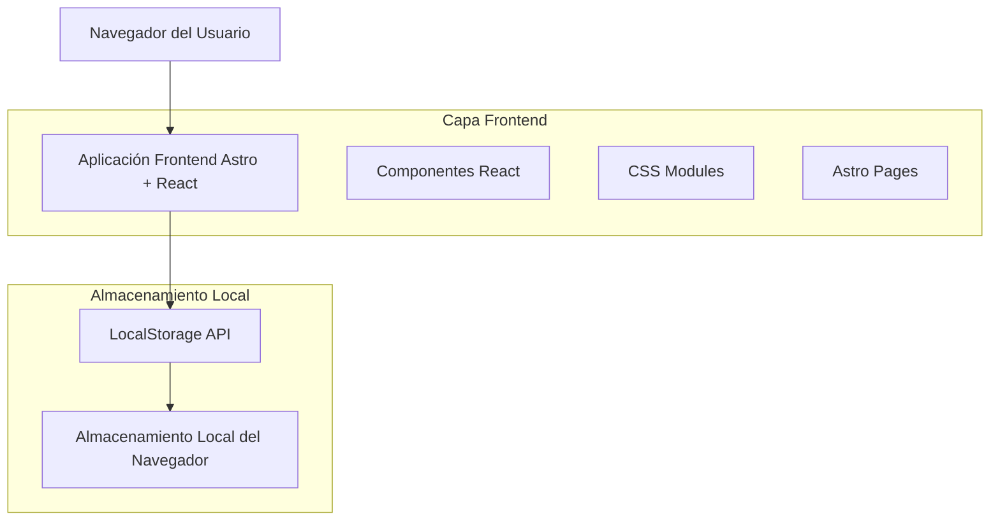

# Documentación de Arquitectura Técnica - Mapas Mentales

## 1. Diseño de Arquitectura



## 2. Descripción de Tecnologías

* **Frontend**: Astro\@4 + React\@18 + CSS Modules + Vite

* **Almacenamiento**: LocalStorage del navegador (sin backend)

* **Styling**: CSS puro con módulos, sin frameworks CSS

* **Iconos**: Lucide React (estilo minimalista)

* **Animaciones**: CSS transitions + Framer Motion (opcional)

## 3. Definiciones de Rutas

| Ruta           | Propósito                                                      |
| -------------- | -------------------------------------------------------------- |
| /              | Página principal con hero section y galería de ejemplos        |
| /dashboard     | Dashboard del usuario con lista de proyectos y accesos rápidos |
| /editor        | Editor de mapas mentales con canvas interactivo                |
| /editor/\[id]  | Editor para un mapa específico existente                       |
| /templates     | Biblioteca de plantillas organizadas por categorías            |
| /settings      | Configuración de usuario y preferencias (guardado local)       |

## 4. Gestión de Datos Local

### 4.1 Estructura de LocalStorage

**Mapas Mentales**
```javascript
// Clave: 'mindmaps'
{
  "maps": [
    {
      "id": "uuid-string",
      "title": "Mi Mapa Mental",
      "content": {
        "nodes": [],
        "connections": [],
        "metadata": {}
      },
      "category": "academic",
      "createdAt": "2024-01-01T00:00:00Z",
      "updatedAt": "2024-01-01T00:00:00Z"
    }
  ]
}
```

**Configuración de Usuario**
```javascript
// Clave: 'userSettings'
{
  "theme": "light",
  "language": "es",
  "autoSave": true,
  "gridVisible": true,
  "snapToGrid": false
}
```

**Plantillas Guardadas**
```javascript
// Clave: 'templates'
{
  "templates": [
    {
      "id": "template-1",
      "name": "Mapa Básico",
      "content": {...},
      "category": "academic"
    }
  ]
}
```

## 5. Servicios de Datos Local

### 5.1 Gestión de LocalStorage

```javascript
// Servicio para gestionar mapas mentales
class MindMapService {
  static STORAGE_KEY = 'mindmaps';
  
  static getAllMaps() {
    const data = localStorage.getItem(this.STORAGE_KEY);
    return data ? JSON.parse(data).maps : [];
  }
  
  static saveMaps(maps) {
    localStorage.setItem(this.STORAGE_KEY, JSON.stringify({ maps }));
  }
  
  static createMap(mapData) {
    const maps = this.getAllMaps();
    const newMap = {
      id: crypto.randomUUID(),
      ...mapData,
      createdAt: new Date().toISOString(),
      updatedAt: new Date().toISOString()
    };
    maps.push(newMap);
    this.saveMaps(maps);
    return newMap;
  }
  
  static updateMap(id, updates) {
    const maps = this.getAllMaps();
    const index = maps.findIndex(map => map.id === id);
    if (index !== -1) {
      maps[index] = { ...maps[index], ...updates, updatedAt: new Date().toISOString() };
      this.saveMaps(maps);
      return maps[index];
    }
    return null;
  }
  
  static deleteMap(id) {
    const maps = this.getAllMaps().filter(map => map.id !== id);
    this.saveMaps(maps);
  }
}
```

### 5.2 Plantillas Predefinidas

```javascript
// Plantillas iniciales que se cargan si no existen
const DEFAULT_TEMPLATES = [
  {
    id: 'basic-mindmap',
    name: 'Mapa Mental Básico',
    description: 'Plantilla simple para comenzar',
    content: {
      nodes: [{ id: 'root', text: 'Tema Central', x: 400, y: 300 }],
      connections: []
    },
    category: 'academic'
  },
  {
    id: 'swot-analysis',
    name: 'Análisis FODA',
    description: 'Plantilla para análisis FODA',
    content: {
      nodes: [
        { id: 'center', text: 'FODA', x: 400, y: 300 },
        { id: 'strengths', text: 'Fortalezas', x: 200, y: 200 },
        { id: 'opportunities', text: 'Oportunidades', x: 600, y: 200 },
        { id: 'weaknesses', text: 'Debilidades', x: 200, y: 400 },
        { id: 'threats', text: 'Amenazas', x: 600, y: 400 }
      ],
      connections: [
        { from: 'center', to: 'strengths' },
        { from: 'center', to: 'opportunities' },
        { from: 'center', to: 'weaknesses' },
        { from: 'center', to: 'threats' }
      ]
    },
    category: 'business'
  }
];
```
```

